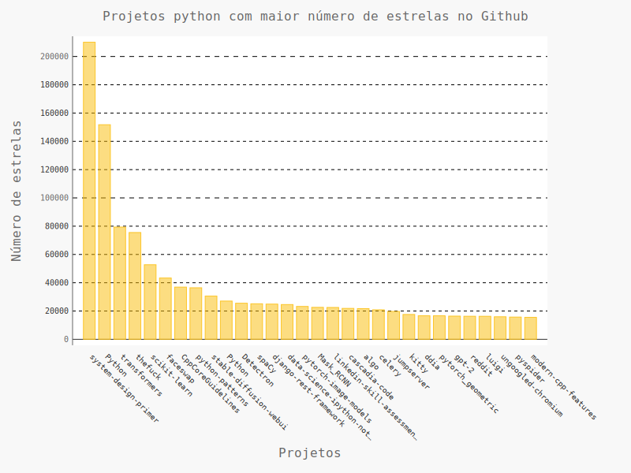
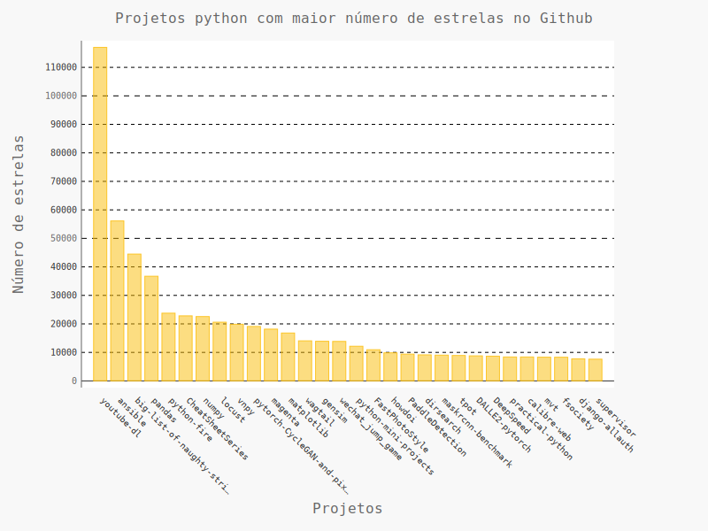
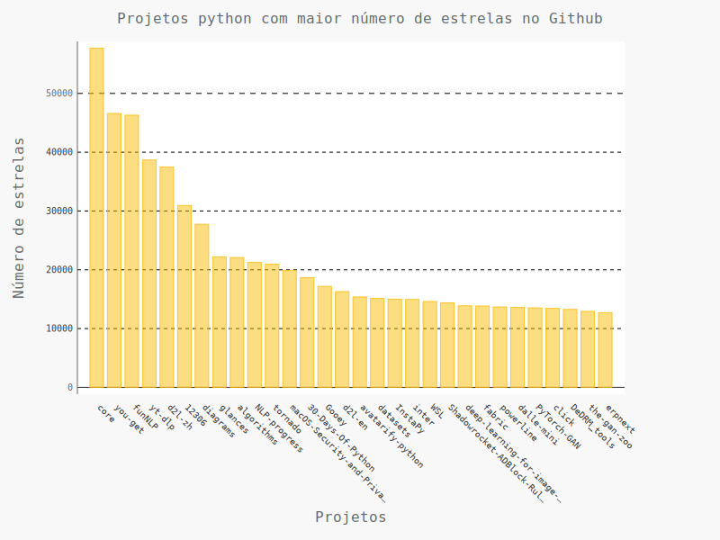
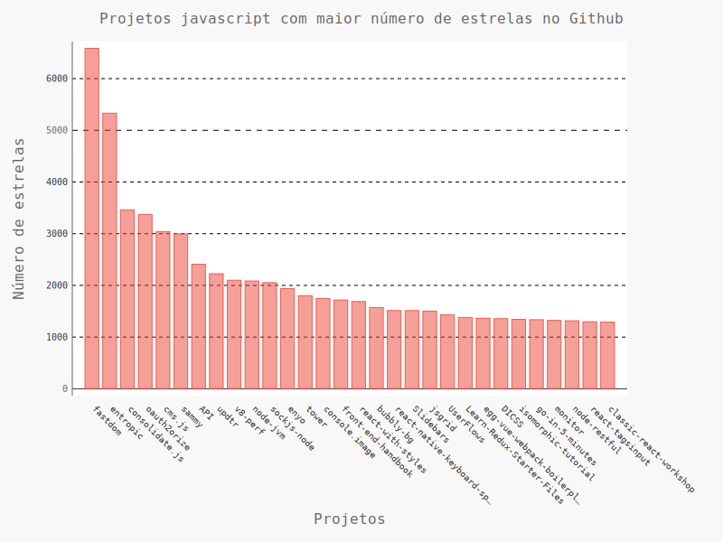
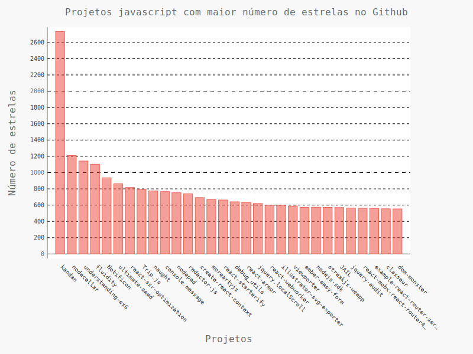
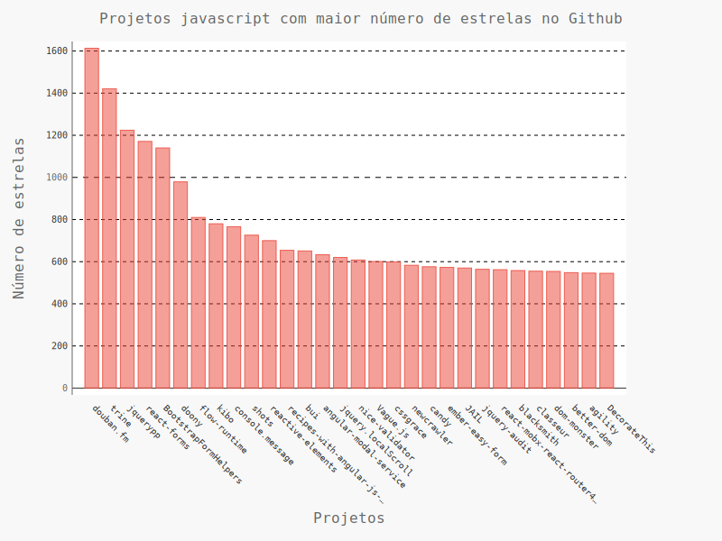
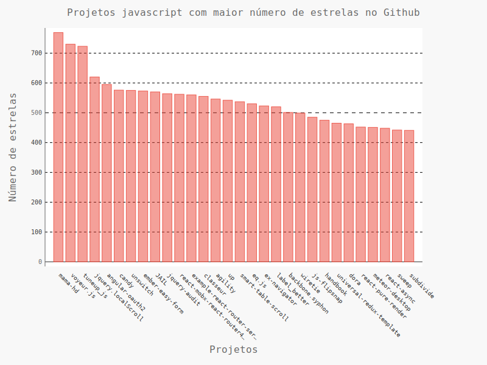

  <h2>Segue abaixo, alguns gráficos sobre o número de projetos python e javascript no Github, por número de estrelas</h2>

  <h3>Python - de 0 a 200.000</h3>
  
  
 
  <h3>Python - de 0 a 110.000</h3>
  
 
  <h3>Python - de 0 a 50.000</h3>
  
 
  <h3>JavaScript - de 0 a 6.000</h3>
  
 
  <h3>JavaScript - de 0 a 2600</h3>
  
 
  <h3>JavaScript - de 0 a 1600</h3>
  
 
  <h3>JavaScript - de 0 a 700</h3>
  

